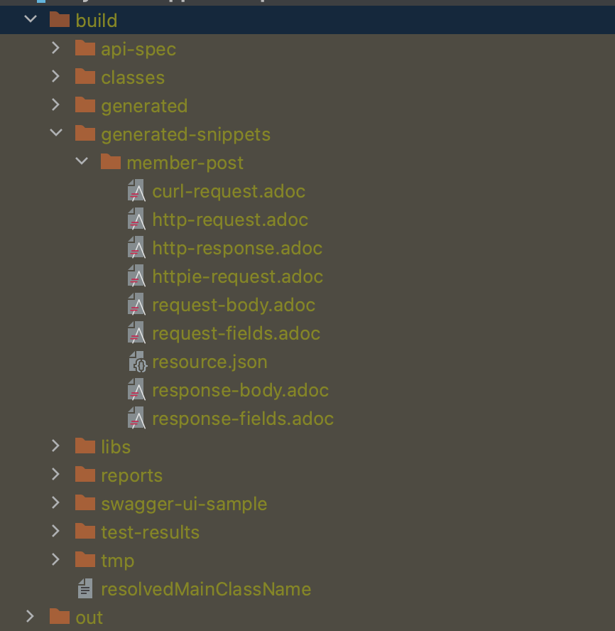
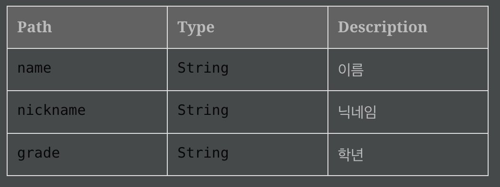
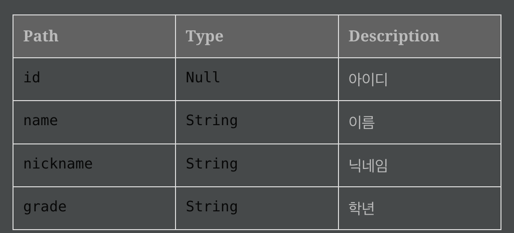
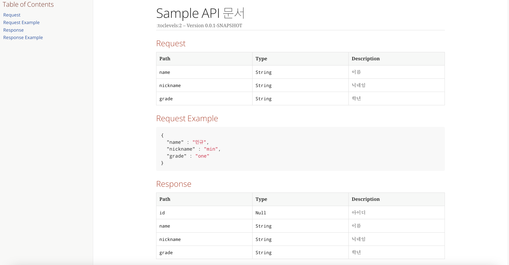

## Spring REST Docs API문서 자동화

---

Spring REST Docs는 Spring 기반의 RESTful API에 대한 문서를 생성하기 위한 도구입니다.  
테스트 코드 기반으로 API 문서를 생성 할 수 있습니다.  
주로 Spring MVC 프레임워크에서 사용되고 테스트 주도 개발(Test-DrivenDevelopment, TDD)에서 효과적입니다.  
다른 자동화 도구들로는 (Swagger, RAML, Postman..)이 있다.

### Spring REST Docs vs Swagger

---

자바 자동 문서화는 두가지를 주로 사용한다.  

#### Spring REST Docs

|   | 장점                   | 단점             |
|---|----------------------|----------------|
| 장점 | 서비스 코드에 영향을 주지 않는다.  | 간편하게 적용이 가능하다  |
|   | 테스트가 성공해야 문서를 만들어준다. | API 테스트가 가능하다. |
| 단점 | 적용이 어렵다.             | 운영 코드에 침투적이다   |
|   |              | 동기화가 안될 수도 있다. |

스웨거는 API 동작을 테스트 하는 용도에 있어 더 특화 되어있고 REST Docs는 깔끔 명료한 문서를 만들 수 있습니다.  
**최근 프로젝트에서는 두가지를 혼용해서 사용했다. ex)Rest Docs -> OpenApi3스펙 변환 -> SwaggerUI 생성**

### Spring REST Docs 사용법

개발 환경
 - Spring Boot 3.2.1
 - JAVA 17
 - Junit5
 - MockMvc
 - AsciiDoc

보통 테스트시 @SpringBootTest 와 @WebMvcTest를 사용합니다.  
해당 코드에서는 통합테스트가 아닌 Controller Layer만 테스트 하기 때문에 @WebMvcTest를 사용하였습니다.

#### 예제

--- 

##### ./build.gradle


```
plugins {
    ...
    id "org.asciidoctor.jvm.convert" version "3.3.2" //(1)
}

configurations {
    asciidoctorExt //(2)
}

dependencies {
    ...
    
    implementation 'org.springframework.boot:spring-boot-starter-web'
    implementation 'org.springframework.boot:spring-boot-starter-validation'
    testImplementation 'org.springframework.restdocs:spring-restdocs-mockmvc' //(3)
    asciidoctorExt 'org.springframework.restdocs:spring-restdocs-asciidoctor' //(4)
}

ext {
    snippetsDir = file("$buildDir/generated-snippets") //(5)
}

test {
    useJUnitPlatform()
    outputs.dir snippetsDir //(6)
}

asciidoctor { //(7)
    configurations 'asciidoctorExt'
    inputs.dir snippetsDir
    dependsOn test
}

asciidoctor.doFirst {
    delete file('src/main/resources/static/docs') //(8)
}

task copyDocument(type: Copy) {
    dependsOn asciidoctor
    from file("$buildDir/docs/asciidoc") // (9)
    into file("src/main/resources/static/docs") // (10)
}

build {
    dependsOn copyDocument // (11)
}

bootJar {
    enabled = true
}
jar {
    enabled = false
}
```

(1) AsciiDoc 파일을 컨버팅하고 Build 폴더에 복사하기 위한 플러그인 입니다.  
(2) asciidoctorExt 라는 의존성 설정을 정의합니다.  
(3) 테스트시 REST Docs에서 제공해주는 MockMvc을 사용하기 위한 라이브러리 추가  
(4) Asciidoctor를 통해 문서로 변환할 때 필요한 라이브러리를 추가.  
(5) Spring REST Docs 결과물 디렉토리 지정  
(6) 테스트시 Spring REST Docs 결과물 저장할 디렉토리 지정  
(7) AsciidoctorExt 라는 설정을 만들고 지정된 디렉토리를 사용하여 이 디렉토리에 변화가 있을때마다 Asciidoctor작업을 다시 실행하고 테스트 후 실행되게끔 test를 의존합니다.  
(8) Asciidoctor 실행전 특정 디렉토리를 삭제합니다.  
(9) 테스크가 실행되기 전에 asciidoctor 테스크가 실행되도록 설정하고 복사항 원본 디렉토리 입니다.  
(10) 복사한 파일을 저장할 대상 디렉토리 입니다. (정적 자원이므로 static에 둡시다!)  
(11) 빌드 작업이 실행되기 전에 copyDocument가 먼저 실행되도록 합니다.  

---

##### 테스트 예제 코드

```java
@WebMvcTest(MemberController.class) // (1)
@AutoConfigureRestDocs // (2)
class MemberControllerTest {

    @Autowired
    private MockMvc mockMvc;

    @Autowired
    private ObjectMapper objectMapper;

    @MockBean
    private MemberBroker memberBroker;

    @Test
    void save() throws Exception {
        // given
        String name = "민규";
        String nickname = "mingyu";
        MemberType memberType = MemberType.one;

        MemberResisterParam param = new MemberResisterParam("민규", "min", "one");

        given(memberBroker.save(any(MemberResisterParam.class))).willReturn(Member.create(name, nickname, memberType)); // (3)

        //when then
        mockMvc.perform(
                        post("/v1/member") //(4)
                                .content(objectMapper.writeValueAsString(param))
                                .contentType(MediaType.APPLICATION_JSON)
                                .accept(MediaType.APPLICATION_JSON)
        )
        .andExpect(status().isCreated()) //(5)
        .andDo(
                document("member-post", // (6)
                        preprocessRequest(prettyPrint()), // (7)
                        preprocessResponse(prettyPrint()), // (8)
                        requestFields( // (9)
                                fieldWithPath("name").type(JsonFieldType.STRING).description("이름"),
                                fieldWithPath("nickname").type(JsonFieldType.STRING).description("닉네임"),
                                fieldWithPath("grade").type(JsonFieldType.STRING).description("학년")
                        ),
                        responseFields( //(10)
                                fieldWithPath("id").type(JsonFieldType.NULL).description("아이디"),
                                fieldWithPath("name").type(JsonFieldType.STRING).description("이름"),
                                fieldWithPath("nickname").type(JsonFieldType.STRING).description("닉네임"),
                                fieldWithPath("grade").type(JsonFieldType.STRING).description("학년")
                        )
                )
        );
    }
}
```

(1) 웹 MVC 테스트를 하기 위한 어노테이션  
(2) REST Docs를 자동으로 구성해주는 어노테이션 API 생성에 필요한 설정을 자동으로 활성화  
(3) 가짜 빈 주입  
(4) 엔드포인트(v1/member)에 POST요청을 하고 전달되는 데이터를 테스트  
(5) 응답 상태 체크  
(6) 문서 이름  
(7), (8) 요청과 응답 데이터 출력을 pretty 포멧팅  
(9) 요청 필드 구조  
(10) 응답 필드 구조  

---

##### 생성 파일



##### http-request
```
POST /v1/member HTTP/1.1
Content-Type: application/json;charset=UTF-8
Accept: application/json
Content-Length: 64
Host: localhost:8080

{
"name" : "민규",
"nickname" : "min",
"grade" : "one"
}
```

##### http-response
```
HTTP/1.1 201 Created
Content-Type: application/json
Content-Length: 82

{
"id" : null,
"name" : "민규",
"nickname" : "mingyu",
"grade" : "one"
}
```

##### request-fields.adoc


##### response-fields.adoc


---

##### adoc 포맷

지정된 경로에 adoc 포맷 파일을 만들어 준다 위 예제의 경우는 docs/asciidoc/sample.adoc

```asciidoc
= Sample API 문서
:doctype: book
:icons: font
:source-highlighter: highlightjs
:toc: left
:toclevels:2

=== Request

include::{snippets}/member-post/request-fields.adoc[]

=== Request Example

include::{snippets}/member-post/request-body.adoc[]

=== Response

include::{snippets}/member-post/response-fields.adoc[]

=== Response Example

include::{snippets}/member-post/response-body.adoc[]
```

위처럼 포맷을 만들고 Gradle 빌드를 완료하면 resources/static/docs/sample.html이 생기고 폼에 맞춰서 아래와 같이 깔끔한 문서가 나온다.



---

#### 정리

사용해본 결과 테스트 코드가 항상 있어야 작동해야 하는 부분도 있고 컨트롤러부분 테스트 코드가 길어지는 부분도 있었다.  
다음에는 길어진 코드를 간략화 하는법도 시도해볼 생각이고 현재는 openAPI3랑 호환이 돼서 Swagger랑 같이쓰면 더 깔끔한 UI와 둘의 장잠을 모두 쓸 수 있는거 같다.

